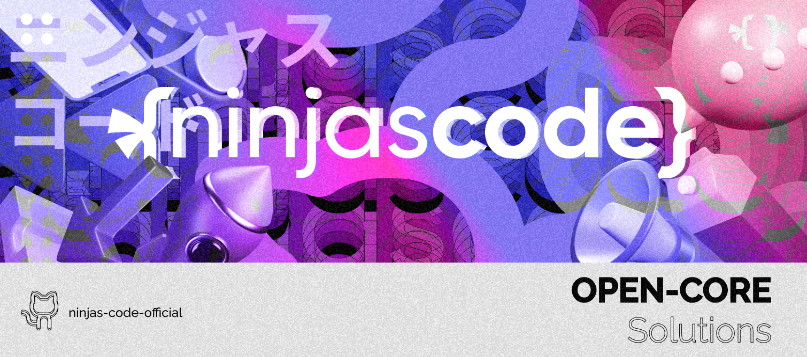

## Hello 👋 Welcome to Ninjas Code 🧑‍💻

Ninjas Code is a software development and solutions company that primarily focuses on open core software solutions. Our goal is to get our solutions to as many people as possible so that we can create a strong community centered around our values for transparency and easy accessibility.

## Our Open Core Projects:

- [Enatega Singlevendor](https://github.com/ninjas-code-official/food-delivery-singlevendor): A restaurant/storefront centric solution for food delivery. It can be used for other types of deliveries as well.
- [Enatega Multivendor](https://github.com/ninjas-code-official/food-delivery-multivendor): A multi vendor delivery management solution similar to foodpanda or UberEats.
- [E-Commero](https://github.com/ninjas-code-official/shopping-cart-ecommerce): A full-fledged package to build an e-commerce application for iOS and Android similar to Myntra/JackThreads.
- [OLO](https://github.com/ninjas-code-official/olx-app-clone-backend): A feature rich solution for creating a listing marketplace for iOS, Android and Web for dashboard.

## Become a Part of Our Growing Community

Join our community on Discord by clicking [here](https://discord.gg/sG3uTGTn).

